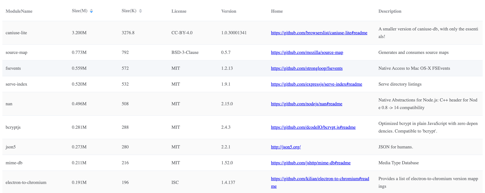

# nm-info

### Get `node_modules` info in your project，display in browser。
- support sort module by size
- jump to module's Homepage




### Usage

```
npm install nm-info -g
```


### TODO
- commander
- other 
